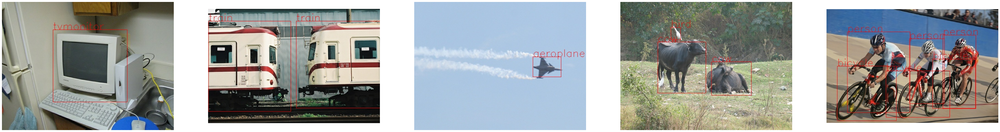
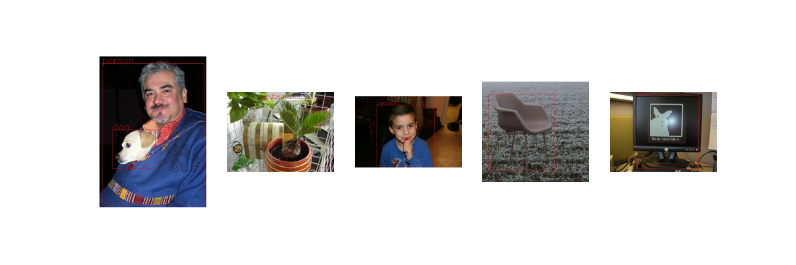
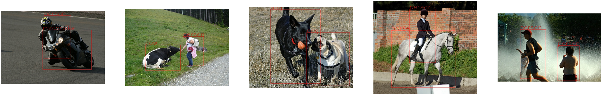

# YOLOv1 Implementation with Tensorflow2
## Introduction
* This repository is implementation code with tensorflow2
## Difference from Original Paper
* Using Xception as Backbone network(to get pre-trained weight)
* Following train strategy from [this code](https://github.com/devbruce/yolov1-tf2) (Batch size, num_epoch, augmentation...)
## Requirement
    python == 3.8
    tensorflow == 2.8.0
    opencv-python == 4.5.5
    albumentations == 1.2.1
## Dataset
* Using PASCAL VOC 2007, PASCAL VOC 2012
* For train, using PASCAL VOC 2007 trainval, PASCAL VOC 2012 trainval
* For validation, using PASCAL VOC 2007 test
* For test, using PASCAL VOC 2012 test
* Dataset dir structure
    ```
  $root/
  ├── VOC2007
  |   ├── Annotations
  |   ├── ImageSets
  |   └── JPEGImages
  ├── VOC2007_test
  ├── VOC2012
  └── VOC2012_test
  ```
* Make Dataset
    ```
  python make_dataset.py --dataset_root --save_dir
  
  args
  --dataset_root : VOC dataset files root directory path
  --save_dir : saved tffrecords files directory
    ```
* After run
    ```
  $save_dir/
  ├── trainval_2007.tfrecord
  ├── trainval_2012.tfrecord
  └── test_2007.tfrecord
    ```
## Train
* Run
    ```
    python train.py --img_size --dataset_dir --s --num_class --num_epoch --batch_size
    
    args
    --img_size : model input size
    --dataset_dir : tfrecord file directory
    --s : output grid number (s X s)
    --num_class : the number of class
    --num_epoch : the number of epoch
    --batch_size : Batch size
    ```
* After run 
  * model weights saved at ckpt dir   
  yolo_final : saved after all epoch   
  yolo_valid_best : saved at lowest valid loss
      ```
    $ckpt/
    ├── yolo_final.index
    ├── yolo_final.data-00000-of-00001
    ├── yolo_valid_best.index
    └── yolo_valid_best.data-00000-of-00001
      ```
  * model asset saved at model_asset dir
    ```
    $model_asset/
    ├── yolo_final
    └── yolo_valid_best
    ```
## Test
* Inference
    ```
  python test.py --model_asset --images_dir
  
  args
  --model_asset : model asset dir path
  --images_dir : test image dir
    ```
* After run   
Inference result saved at infer dir
## Result
* Train

* Validation

* Test

## Reference
[1] You Only Look Once: Unified, Real-Time Object Detection. Joseph Redmon, Santosh Divvala, Ross Girshick, Ali Farhadi   
[2] [devbruce / yolov1-tf2](https://github.com/devbruce/yolov1-tf2)